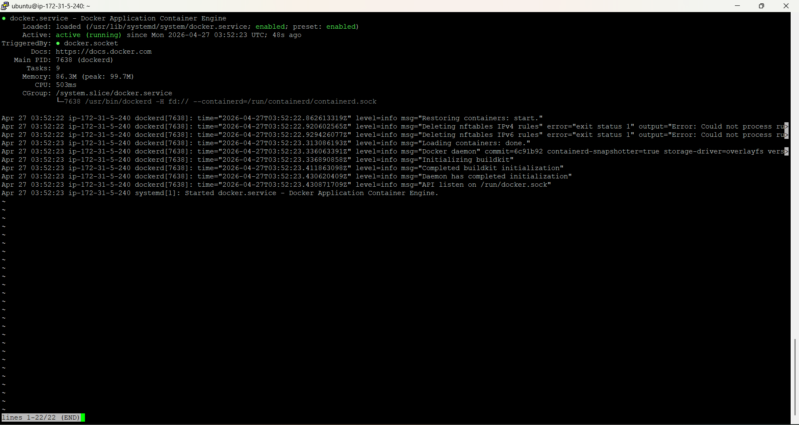
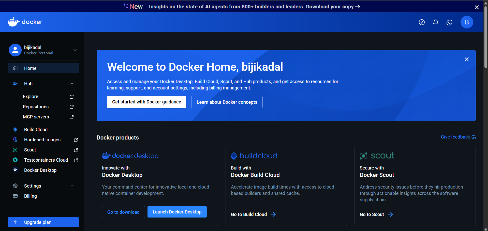
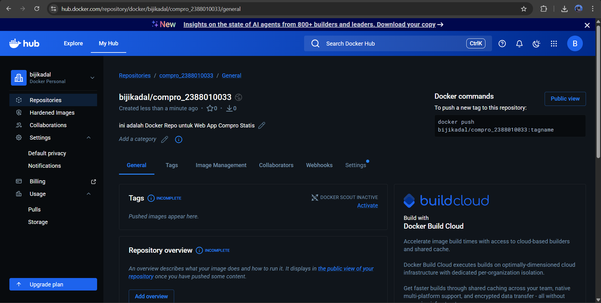
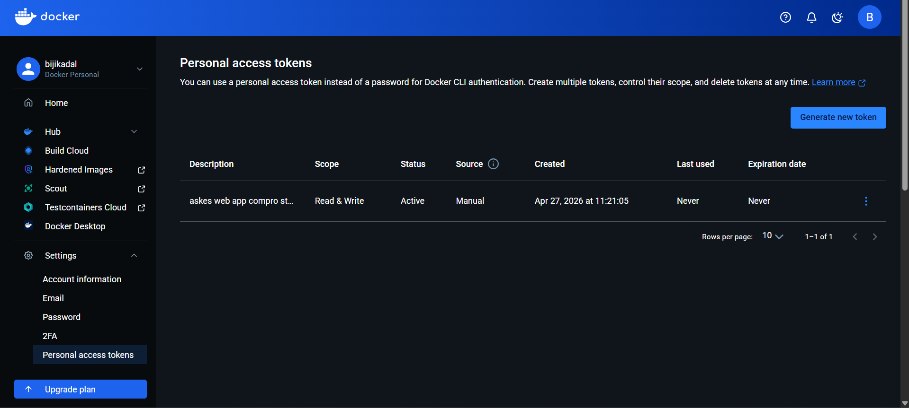
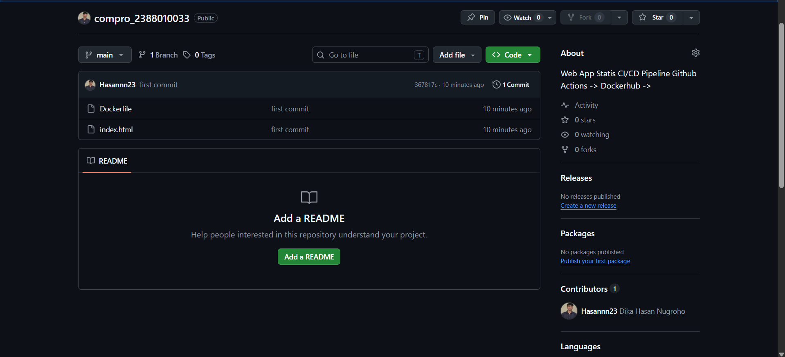

1. # install docker :
https://docs.docker.com/engine/install/ubuntu/

2. Uninstall old versions 
sudo apt remove $(dpkg --get-selections docker.io docker-compose docker-compose-v2 docker-doc podman-docker containerd runc | cut -f1)

3. # Set up Docker's repository.apt :
    1. # Add Docker's official GPG key:
    - sudo apt update
    - sudo apt install ca-certificates curl
    - sudo install -m 0755 -d /etc/apt/keyrings
    - sudo curl -fsSL https://download.docker.com/linux/ubuntu/gpg -o /etc/apt/keyrings/docker.asc
    - sudo chmod a+r /etc/apt/keyrings/docker.asc
    2. # Add the repository to Apt sources:
    - sudo tee /etc/apt/sources.list.d/docker.sources <<EOF
    - Types: deb
    - URIs: https://download.docker.com/linux/ubuntu
    - Suites: $(. /etc/os-release && echo "${UBUNTU_CODENAME:-$VERSION_CODENAME}")
    - Components: stable
    - Architectures: $(dpkg --print-architecture)
    - Signed-By: /etc/apt/keyrings/docker.asc
    - EOF
    3. update os -> sudo apt update
    4. To install the latest version, run:
    - sudo apt install docker-ce docker-ce-cli containerd.io docker-buildx-plugin docker-compose-plugin
    5. After installation, verify that Docker is running:
    - sudo systemctl status docker
    
    - https://hub.docker.com/

    
4. # Registrasi Docker hub
    - URL singup
    - Continue with github
    

5. # Create Repository
    - click menu -> hub -> repostiory
    - clik button new repository
    - isi nama repository = compro-nim dan deskripsi = web apps statis compro
    - visibility = public
    - create
    

6. # Create token Accsess
    - klik profil -> account setting => personal acces tokens
    - klik generate new tokens
    - expire date = none
    - acces permison = read/white
    - klick generate
    

7. # Create Projek di local
    - buat folder compro_nim
    - masukan file index.html compro
    - buatl file dockerfile FROM nginx:alpine COPY index.html /usr/share/nginx/html
    - EXPOSE 80
    