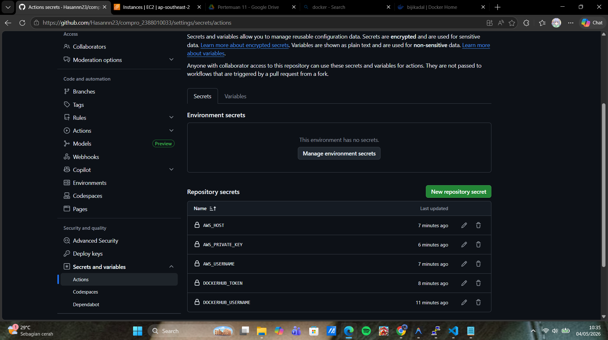
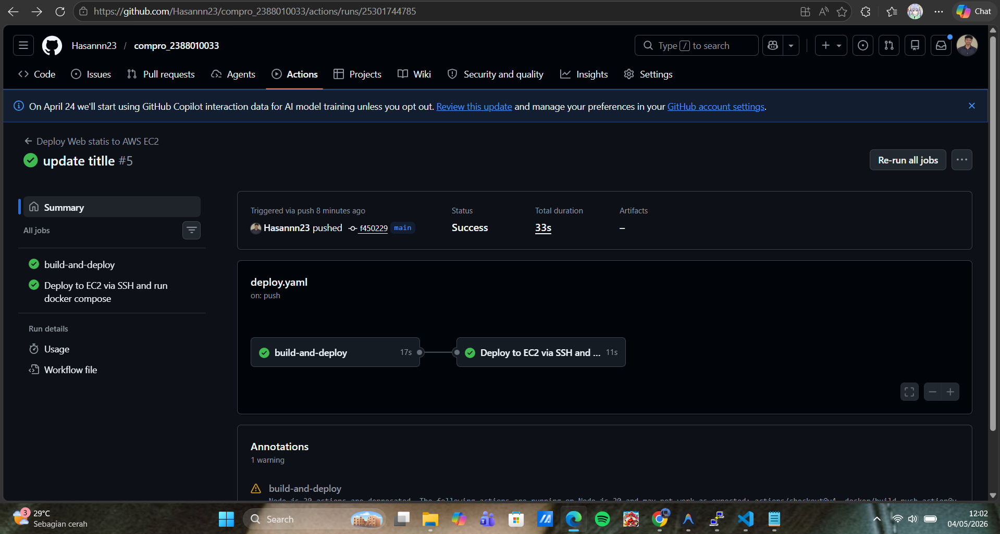
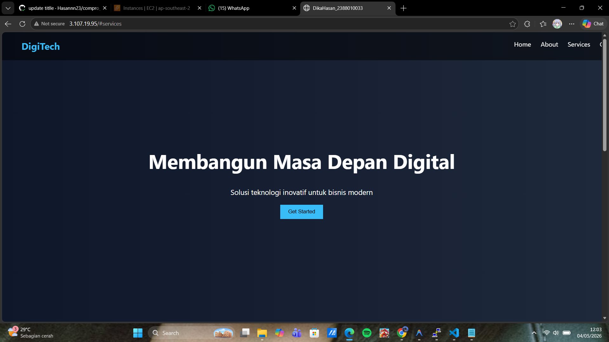

# modernisasi CI/CD (continuous Integration/Continuous Delivery)
## Lanjutan Pratikum Pertemuan-10

1. Mengisi Secrets Variable di Github Action
    - Buka Repository, klik tab Settings > Secrets and variables > Actions.
    - Klik tombol New repository secret.
    - Klik New repository secret, lalu masukkan nilai berikut:
        - Name : DOCKERHUB_USERNAME
        - Value : USERNAME di docker
    - Ulangi langkah di atas untuk secret berikut:
        - Name : DOCKERHUB_TOKEN
        - Value :   token docker
    - Klik tombol New repository secret.
    - Klik New repository secret, lalu masukkan nilai berikut:
        - Name : AWS_HOST
        - Value : IP addres
    - Klik tombol New repository secret.
    - Klik New repository secret, lalu masukkan nilai berikut:
        - Name : AWS_USERNAME
        - Value : ubuntu
    - Klik tombol New repository secret.
    - Klik New repository secret, lalu masukkan nilai berikut:
        - Name : AWS_PRIVATE_KEY
        - Value : Private key.pem

2. Melakukan Edit File Pipeline di Github
    - Buka Projek Compro_nim
    - Buat Folder Baru .github -> Buat Folder workflows -> Buat File deploy.yaml
    - isi file deploy.yaml sebagai berikut: 
    name : Deploy Next.js to AWS EC2
    on:
        push:
            branches: [ main ]
    jobs:
        build-and-deploy:
            runs-on: ubuntu-latest
            steps:
                - name: Checkout code
                  uses: actions/checkout@v3
                
                - name: Login to Docker Hub
                  uses: docker/login-action@v2
                  with:
                    username : ${{ secrets.DOCKERHUB_USERNAME }}
                    password : ${{ secrets.DOCKERHUB_TOKEN }}
                
                - name: Build and push Docker image
                  uses: docker/build-push-action@v4
                  with:
                    context: .
                    push: true
                    tags: ${{ secrets.DOCKERHUB_USERNAME }}/compro-nim:latest
                
                - name: Deploy to EC2 via SSH and run docker compose
                  uses: appleboy/ssh-action@v1.0.1
                  with:
                    host: ${{ secrets.AWS_HOST }}
                    username: ${{ secrets.AWS_USERNAME }}
                    key: ${{ secrets.AWS_PRIVATE_KEY }}
                    port: 22
                    script: |
                      docker rm -f compro_nim
                      docker pull ${{ secrets.DOCKERHUB_USERNAME }}/compro_nim:latest
                      docker run -d --name compro_nim -p 80:80 ${{ secrets.DOCKERHUB_USERNAME }}/compro_nim:latest
3. sebelum melakukan commit dan synch pada file
        - pastikan sudah disable apache2 -> sudo systemctl disable apache2
        - pastikan sudah stop apache2 -> sudo systemctl stop apache2
        - pastikan user ubuntu sudah ditambahkan
        - baru lakukan commit dan push ke github

4. lakukan update tittle pada index html lalu push
