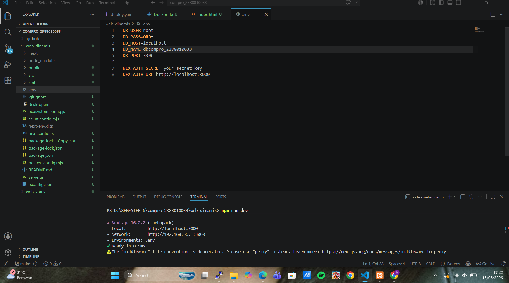
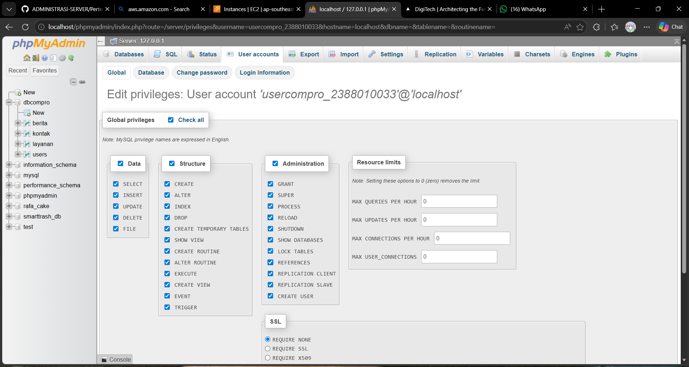
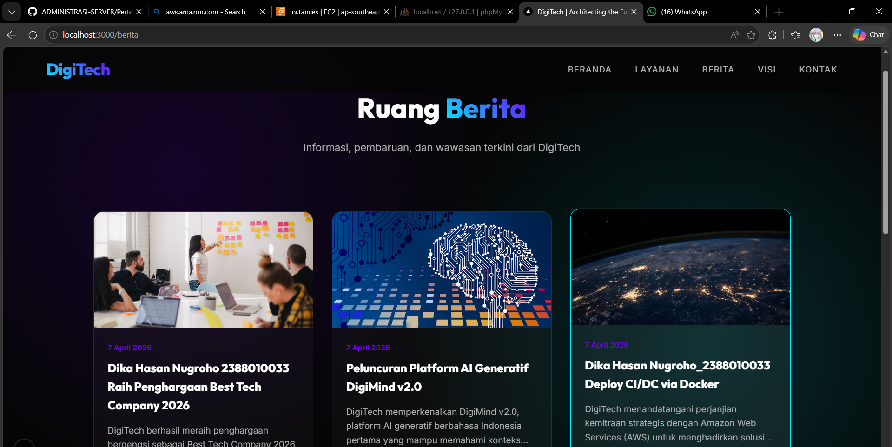

# DEploy Multi Apps CI/CD Docker

1. Start Instance di AWS EC2
2. Patching OS -> sudo apt-get update && sudo apt-get upgrade
3. Hapus Layanan nginx dan uninstall -> sudo systemctl stop apache2 && sudo systemctl disabel apache2
    sudo apt remove apache2
4. Hapus layanan Mariadb dan uninstall -> sudo systemctl stop mariadb && sudo systemctl disabel mariadb
    sudo apt auto-remove mariadb-server
5. Testing Next.js + db menggunakan user bukan root pada local enviroment
    - copy project digitech pada ptm6 kecuali folder .next, node_modules, sql, kedalam folder web-dinamis

    - create user baru bukan root di DBMS (xampp)

    - sesuaikan isi file .env
    - open terminal > cd web-dinamis
    - npm install
    - npm run dev

