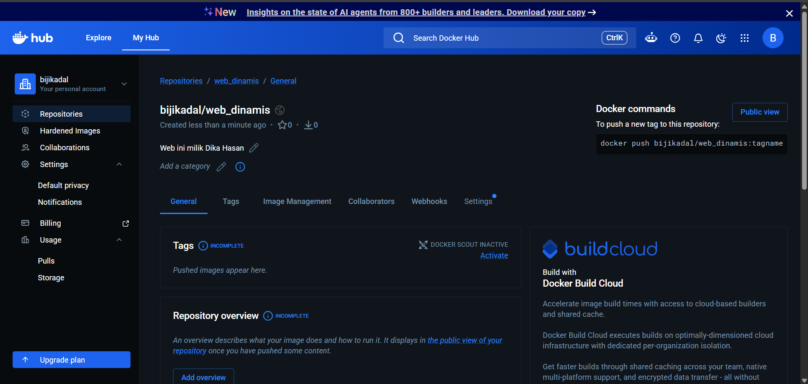
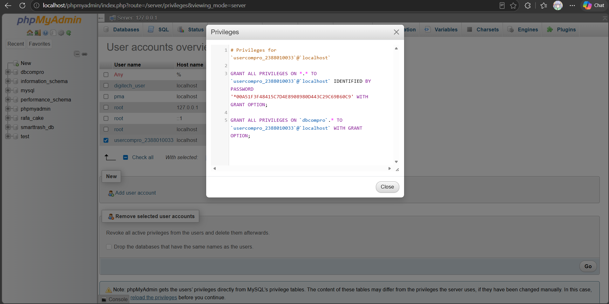
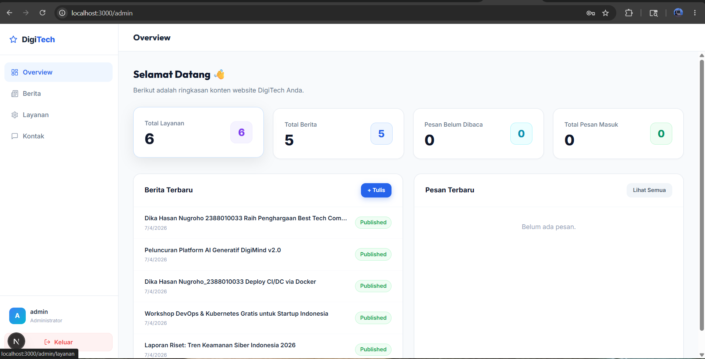
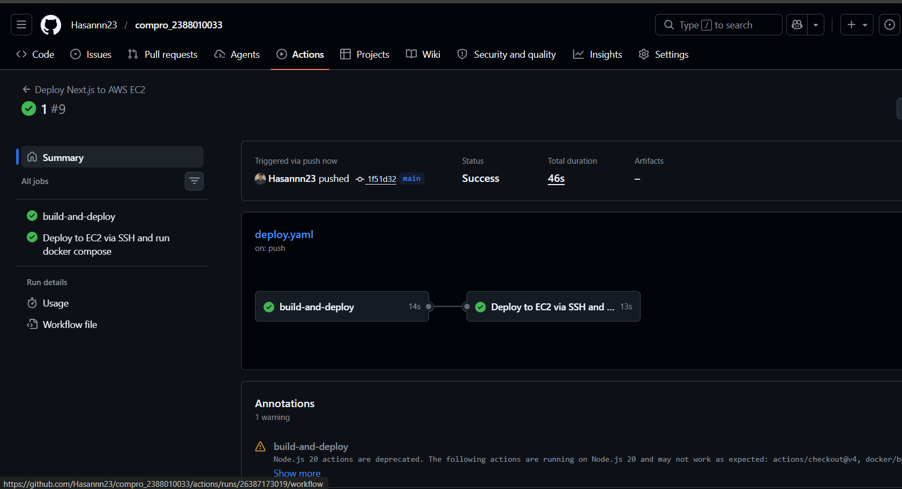
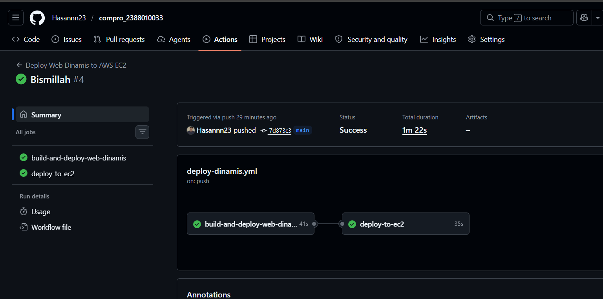
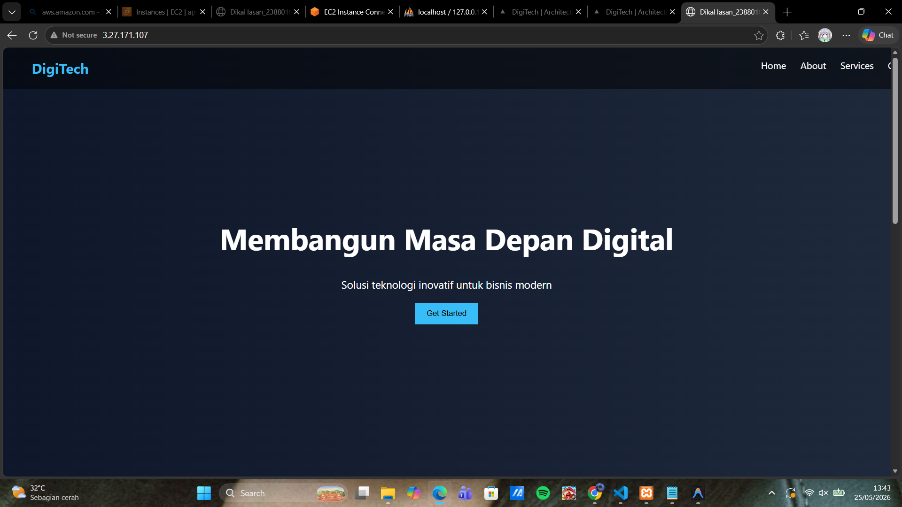
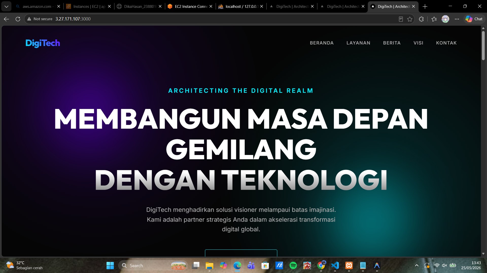
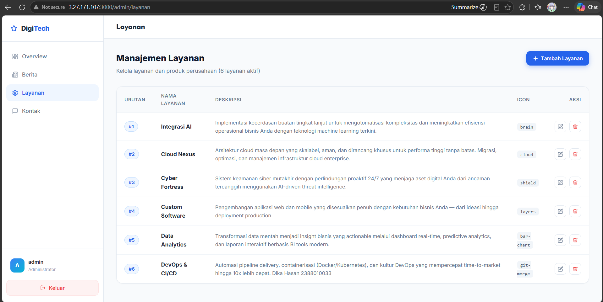

# Deploy Multiple Container menggunakan Docker Compose

1. start instance aws ec2
2. patching os -> sudo apt update && sudo apt upgrade
3. hapus layanan nginx dan uninstall -> sudo systemctl stop nginx && sudo systemctl disable nginx sudo apt remove apache2
4. hapus layanan mariadb dan uninstall -> sudo systemctl stop mariadb && sudo systemctl disable mariadb sudo apt auto-remove mariadb-server sudo apt remove mariadb-server mariadb-client mariadb-common
4. Bikin repository baru di docker untuk web dinamis

5. Buka Projek Company himafor_nim
6. Bagi 2 Folder untuk projek Web App Statis dan Dinamis
7. Move file index dan Dcoker milik web statis ke Folder web-statis
8. Copy Folder Projek Next.JS (pertemuan9)ke folder web-dinamis
Lakukan Testing di Local Project Next.JS
    - Install Dependencies: npm install
    - Create user di DBMS : sudo mysql -u root -p
    - Install Dependencies: npm install
    - Create user di DBMS : sudo mysql -u root -p
    - CREATE USER 'usercompro_2388010033'@'localhost' IDENTIFIED BY 'ga0PfkOqDdqKjY_A';
    - GRANT ALL PRIVILEGES ON . TO 'usercompro_2388010033'@'localhost';
    - FLUSH PRIVILEGES;

    - Edit File .env di folder web-dinamis 
    - npm run build 
    - npm start 
    - Pastikan web dapat diakses di http://localhost:3000 admin tanpa error

9. Buat file Dockerfile
10. Buat file docker-compose.yml
11. Buat Workflows File -> deploy-dinamis.yml di folder .github workflows/ dari Projek web-dinamis
12. Edit File -> deploy.yml di folder .github/workflows/ untuk
13. Update Host AWS di Github
14. Commit Changes ke GitHub dari lokal
15. Push Changes ke GitHub
16. Cek di Github, apakah actions jalan dan berhasi

