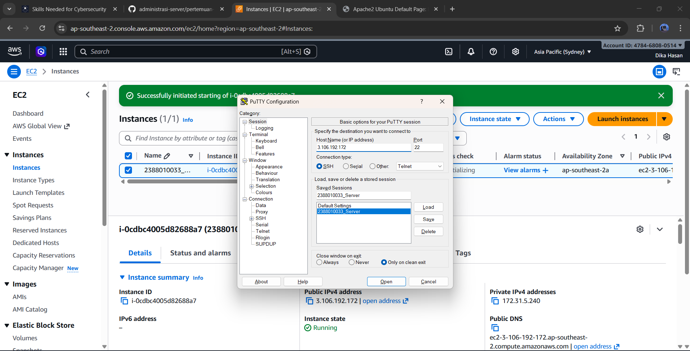
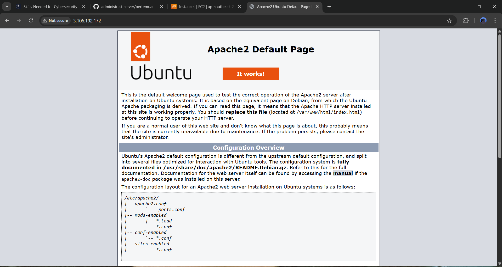
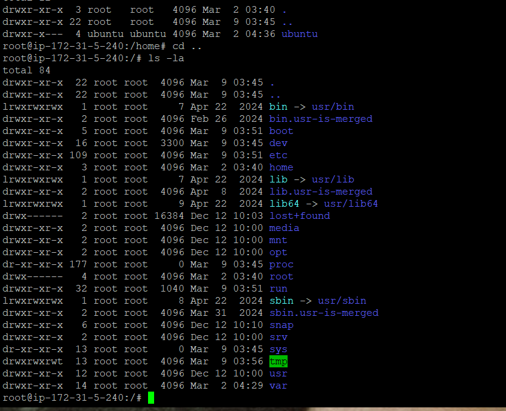
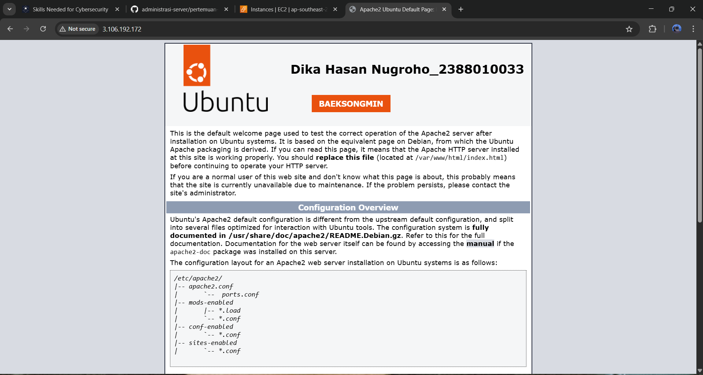

1. start instance 
2. buka putty
3. kemudian load save sesion yang disimpan pada pertemuan 2
4. update bagian ipaddres v4

5. sudo apt-get update untuk paching os linux
6. cek webserver kita systemctl status apache2
7. stop sudo systemctl stop apache2
8. start  sudo systemctl stop apache2

9. masukan command (ls -la) untuk melihat directory tempat cursor aktif
10. masukan sudo su (untuk masuk ke home)
11. masukan cd ../.. untuk masuk ke root folder
12. ls -la\

13. masuk ke folder var (cd var/www/html)
14. nano index.html 
15. Ubah Menjadi Nama dan _NIM
