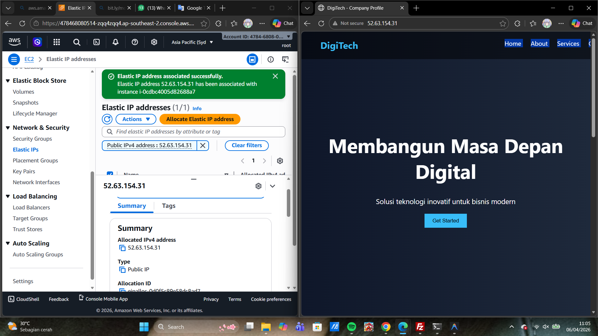

# Membuat elastic ip

1. nyalakan instance ec2 yang sudah di create sebelumnya
2. ke menu network dan security pilih menu ELASTIC IPs
    - Klik Menu Allocate Elastic IP address
    - pilih Amazon's pool of IPv4 addresses
    - Network border group (south east asia)
    - isi tags (key-server-6B VALUE = pratikum elastic ip)
    - klik allocate
3. assosiacte kan elastic ip segera mungkin (>1 jam akan kena cost)
    - centang mana eip yang dipilih
    - pilih action -> assosicate elastic ip
    - pilih instance 
    - klik assosiacate
    