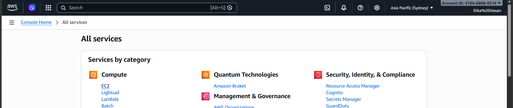
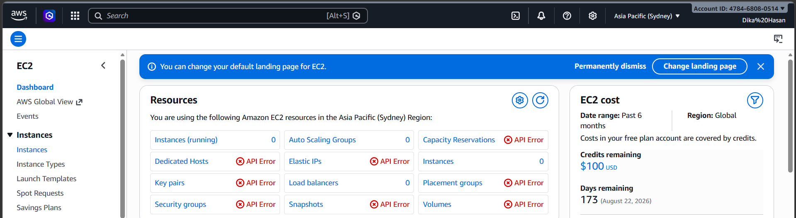
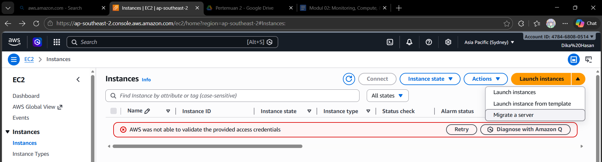
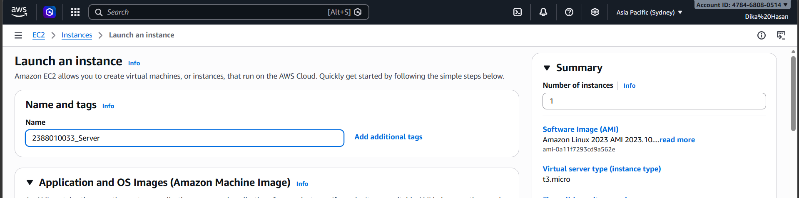
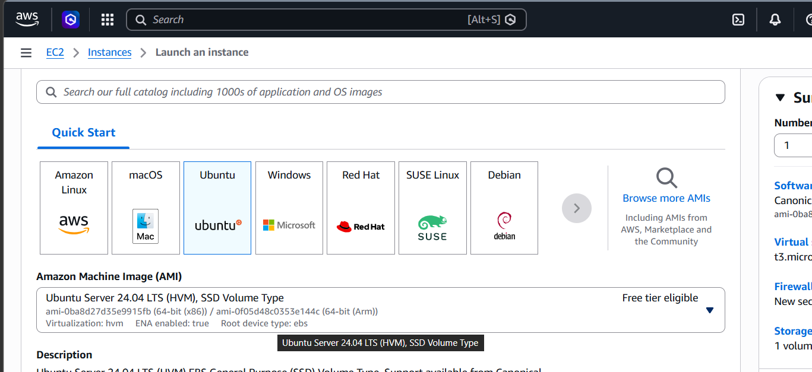
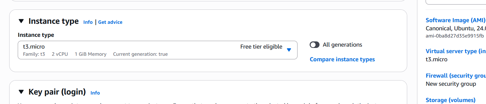
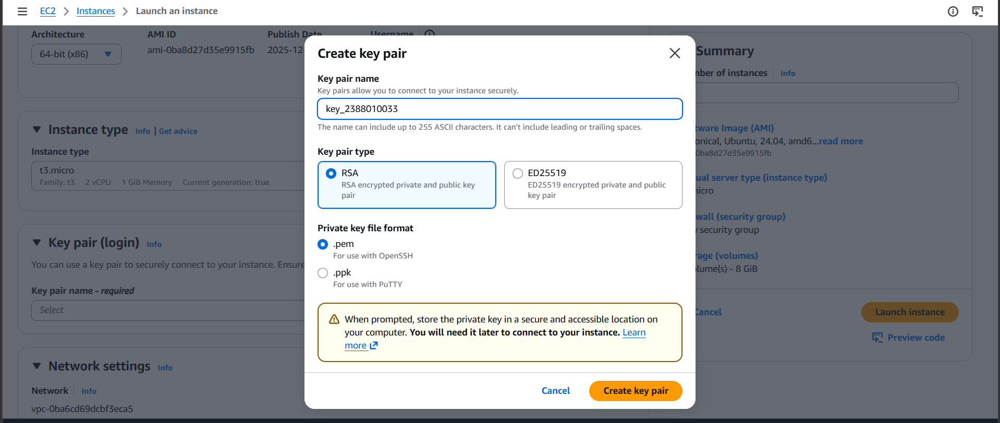
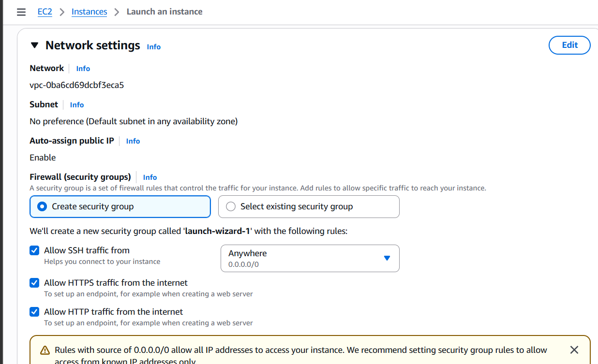
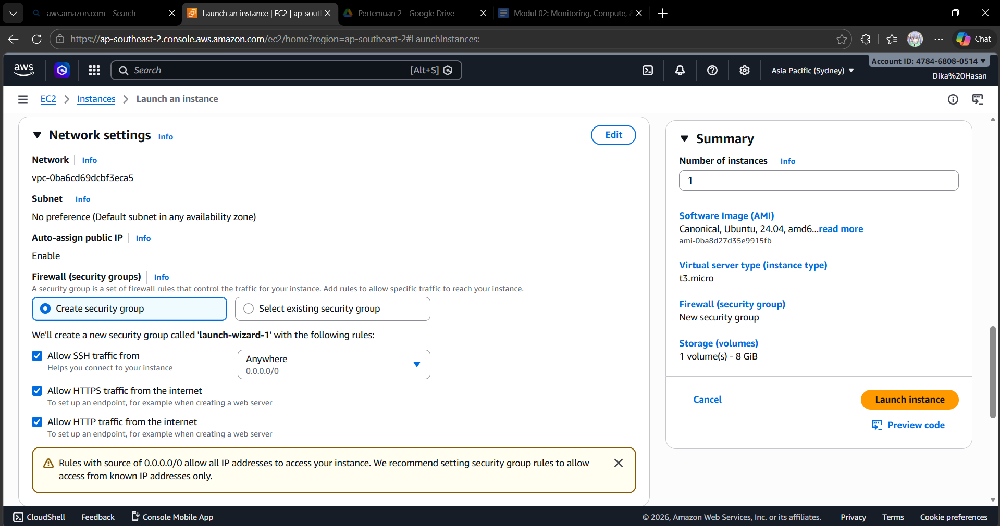
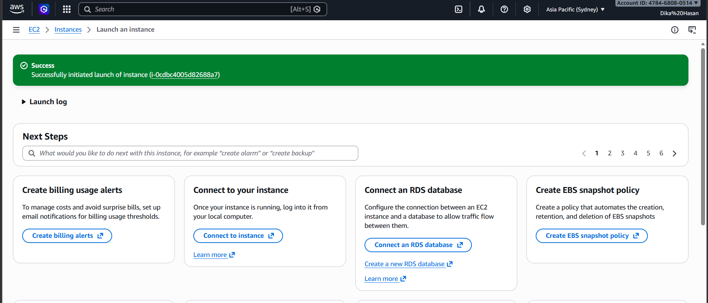

# membuat EC2 / instance / VM

1. Pilih Menu All Service / EC2 

2. Pilih Menu Intance

3. Pilih Meu Launch Instance

4. Beri nama instance dengan format NIM_Server

5. Pilih OS Server Untuk Instance

6. Pilih Resource instance T3.micro (2VCPU 1GB)

7. membuat key pair dan new key pair lalu pilih RSA, creat key pair

8. setting Kebijakan keamanan / Security Group
    - Allow SSH -> Artinya Membolehkan Remote SSH dari luar
    - Allow HTTPS -> 
    - Allow HTTP -> 

9. Setelah Selesai Set-up Pilih Launch Instance

10. Pastikan Launch Instance Sukses

